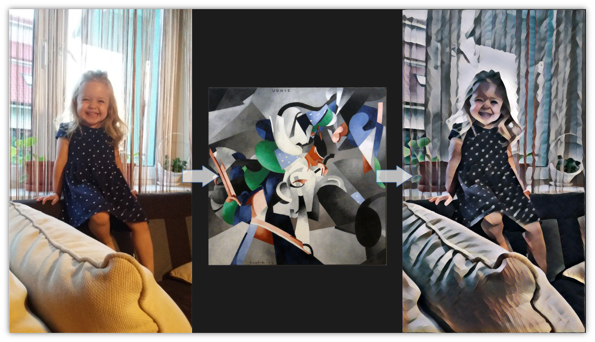
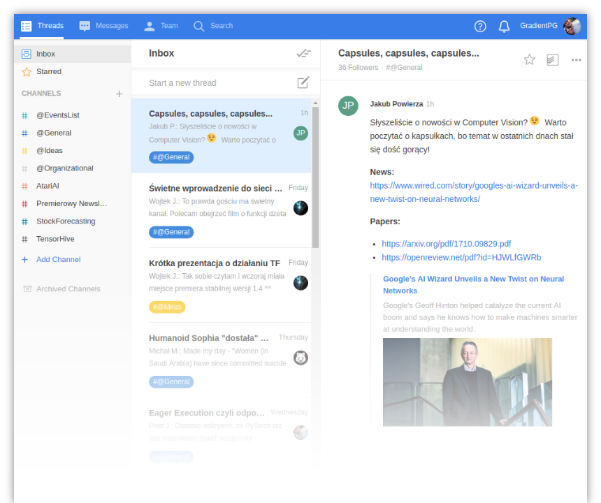

name: title
class: center, middle

# Witajcie!

---

class: center, middle, title

# Kim jesteśmy?

---

class: middle

???

Jesteśmy **grupą studentów** WETI, która z zamiłowania i pasji **interesuje się tematyką uczenia maszynowego**. W szczególności naszym sercom przypadły **głębokie sieci neuronowe**, które staramy się **poznać w praktyce** na naszych spotkaniach.

To zdjęcie powstało podczas 65-lecia...

---

class: middle

???

...z wykorzystaniem metody "Fast Style Transfer".

1. Wykorzystane w budce fotograficznej.

2. Organizowaliśmy prelekcje o:
  * Wprowadzenie do SI,
  * AI w Facebooku,
  * Autonomiczne Pojazdy,
  * Reinforcement Learning and DeepMind

---

class: center, middle, title

# Jaki mamy cel?

---

class: center, middle

# Utworzyć ***społeczność***...
## ...kreatywnych młodych ludzi pełnych ***energii i pasji*** do ciężkiej, ale satysfakcjonującej pracy!

???

* **Umożliwienie wspólnego rozwój** w szerokiej i prężnie rozwijającej się dziedzinie uczenia maszynowego, a w szczególności sieciach neuronowych.

* Tworzenie społeczności, w której członkowie mogą **odnaleźć wzajemną pomoc** we własnych projektach oraz **inspirację i znajomości** do rozpoczynania nowych ciekawych i innowacyjnych projektów.

* **Utrzymywać stały kontakt z naukowcami, uczelnią oraz sektorem gospodarczym**, w celu pozyskiwania specjalistycznej wiedzy oraz sprzętu.

* Chcemy **promować samo uczenie maszynowe, ale również naszą uczelnię**, jako miejsce rozwoju najnowszych technologii.

---

class: center, middle, title

# Organizacja spotkań 

---

.left-column[
### Organizacja
## Kiedy?
]

.right-column[
.center[
## Co drugi poniedziałek...
### ...chyba że inaczej.
]

* Rozkład jazdy na stronie internetowej w zakładce "Spotkania".
* Zawsze w weekend przed spotkaniem rozsyłane jest zaproszenie z agendą. 
]

---

.left-column[
### Organizacja
## Kiedy?
## Gdzie?
]

.right-column[
.center[
## AUD1L lub NE207
### ...chyba że inaczej.

]
]

???

# Zależy od ilości osób.

---

.left-column[
### Organizacja
## Kiedy?
## Gdzie?
## Co?
]

.right-column[
.pull-left[
.center[
## Mini-kursy
### Pierwsza godzina
]
* Wprowadzenie do ANN,

* Wizja komputerowa za pomocą CNN,

* Rekurencyjne sieci neuronowe,

* Uczenie ze wzmocnieniem,

* TensorFlow.
]
.pull-right[
.center[
## Prezentacje
### Druga godzina

**To czas dla Ciebie!**

Co ciekawego dokonałeś i chciałbyś się pochwalić?
]]]

???

## Mini kursy
* **Interaktywne wprowadzenie** z mgr Karolem Draszaką (ML) oraz Krzyśkiem Przekwasem (MNIST),
* Wprowadzenie do **wizja komputerowa za pomocą ConvNet-ów** z Jakubem Powierzą, zakończone **"Transfer Learningiem"** z mgr Adamem Brzeskim,
* **Wprowadzenie do RNN-ów** z Grzegorzem Beringerem, zakończone **generowaniem muzyki** przez Michała Góreckiego,
* **Uczenie ze wzmocnieniem** przez mła, trochę teorii, polane praktyką,
* **Wprowadzenie i uczenie rozproszone w TF** przez Wojtka Janowskiego oraz mgr Pawła Rościszewskiego.

## Prezentacje
* 45 minut do 1 godziny,
* Nie od razu Rzym zbudowano!
* Coś pozornie łatwego dla nas, może być warte uwagi dla innych *(proste jest jak się zrobi)*.

---

class: center, middle, title

# Gdzie się dzieje?

---

class: center

# Strona internetowa

???

1. **Post o kolejnym spotkaniu**, to samo co na maila,
2. **Kalendarz spotkań**, agenda mini-kursy i prezentacje,
3. **Lista dużych projektów**, wraz z opisami i odnośnikami,
4. **Kontakt** do nas,
5. **Baza Wiedzy**,
6. **Statut**,

---

class: center

# Facebook

???

1. **Kontakt** poprzez wiadomości,
2. **Posty** o kolejnych spotkaniach,
3. **Wydarzenia** związane z kołem,
4. **Ciekawostki** z dziedziny ML i ANN.

---

class: center

# Grupa google

???

1. **Lista członków**,
2. **Zaproszenia** oraz **główny kanał informacyjny** dla członków,
3. **Dyskusje**, ale lepiej na *Twist-cie*.

---

class: center

# TwistApp 

???

1. **Duskusje:**
  * Na temat **projektów**
  * Na tematy z dziedziny **ML i ANN**
2. **Zapytania** do członków, na pewno ktoś odpowie,
3. **Pomysły** na najróżniejsze aktywności koła,
4. **Ciekawostki** ze świata ML i ANN.
5. **Posty do newsletter-a** zbierane są na specjalnym kanale.

---

class: middle, center, title

# Czym możecie się zająć?

???

## 1. Prezentacje *(wspominałeś)*,
## 2. Newsletter *(opowiedz)*,
## 3. PROJEKTY!!! *(zaproś)...*

*Teraz zaczyna się część prezentowania projektów...*
* Emotion Mini Utility - Paweł Kopeć
* Generowanie muzyki - Michał Górecki
* Stock Forecasting - Jakub Karczewski
* Prezentacja frameworka TensorFlow - Wojtek J.
* TensorHive - mgr Paweł Rościszewski
* AtariAI - Piotr Januszewski

---

class: middle, center, title

# AtariAI
### Sztuczna inteligencja i Uczenie ze wzmocnieniem

???

# Aktualnie: One Man Army
## Docelowo grupa zajmująca się różnymi projektami z RL.

---

.left-column[
## AtariAI
### Wcześniej
]

.right-column[
.center[
# PG Pong
.pull-left[
### Przed

]
.pull-right[
### Po

]]]

???

1. Agent przyjmuje **obrazy na wejściu**,
2. Na podstawie **obrazu decyduje o akcji**,
3. Z wbudowanej w grę **punktacji uczy się** podejmować lepsze akcje.

_Wskaż na to jak grał **przed**, a jak grał **po** uczeniu._

---

.left-column[
## AtariAI
### Wcześniej
]

.right-column[
.center[
# Teoria
]
$$V^\*(s) = \max\_a\sum\_{s'}P(s'|s,a)[R(s,a,s') + \gamma V^\*(s')]$$

1. Dużo teoretycznych przygotowań,

2. Trochę prezentacji na kole,

3. Kilka praktycznych ćwiczeń.
]

.right-column[
.center[
## Materiały znajdą się w Bazie Wiedzy.
]]

???

0. Czy ktoś kojarzy to równanie? *Bellman optimality equation*
  * **Układ równań** z unikatowym rozwiązaniem V\*(s),
  * Od V\*(S) do **optymalnej policy** jest rzut kapeluszem.

1. Teoria to **nic nudnego**! Teoria znaczy:
  * **Wspaniałe wykłady**, wspaniałych prelegentów,
  * **Ciekawe książki**, wybitnych osób,
  * **Interesujące blogi**, pasjonatów RL.

2. Polecam każdemu, aby **dzielił się swoją wiedzą** na spotkaniach. Jest to obopólna korzyść.

3. Zawsze należy **utrwalić swoją teorię w praktycznych** ćwiczeniach "matematycznych" i programistycznych.

Materiały będą w **bazie wiedzy** lub można się **ze mną kontaktować**.

---

.left-column[
## AtariAI
### Wcześniej
### Teraz
]

.right-column[
.center[
# Roll-a-Ball

## Unity3D ML-Agent

]]

???

# Wolność tworzenia środowisk do nauki agentów!

Środowisko **w Unity3D**, a model uczenia ze wzmocnieniem **w Pythonie** w jakimkolwiek framework-u.

1. Aktualnie **Roll-a-ball**, aby poznać to narzędzie.
2. **Następnie kolejne** projekty!

---

.left-column[
## AtariAI
### Wcześniej
### Teraz
### Za rogiem
]

.right-column[
.center[
## Uczenie z preferencji człowieka

## Poruszanie się jak prawdziwe organizmy

]]

???

1. Opisz jaki problem rozwiązuje uczenie z preferencji człowieka/**odwrócone uczenie ze wzmocnieniem**.

2. Wyjaśnij o co chodziło w *"Terrain-Adaptive Locomotion Skills Using Deep Reinforcement Learning"* oraz o projekcie **Dorsz**.

---

class: middle, center, title

## Shut Up and Take My Money
### Czyli od czego zacząć?

???

Na pewno wszyscy nie możecie już usiedzieć po tym co zobaczyliście...

# Od czego zacząć?!

---

class: middle, center

# Zapisy na...
## gradientpg@gmail.com

???

## Proszę przesyłać swoje adresy mailowe najlepiej w domenie google.

---

class: middle, center

# Baza Wiedzy na...
## gradient.eti.pg.gda.pl

???

## Zakładka "Baza Wiedzy" na naszej stronie internetowej, tam znajdziecie materiały.

---

class: middle, center, title

# Q&A

---

class: center, middle

# Do zobaczenia!
