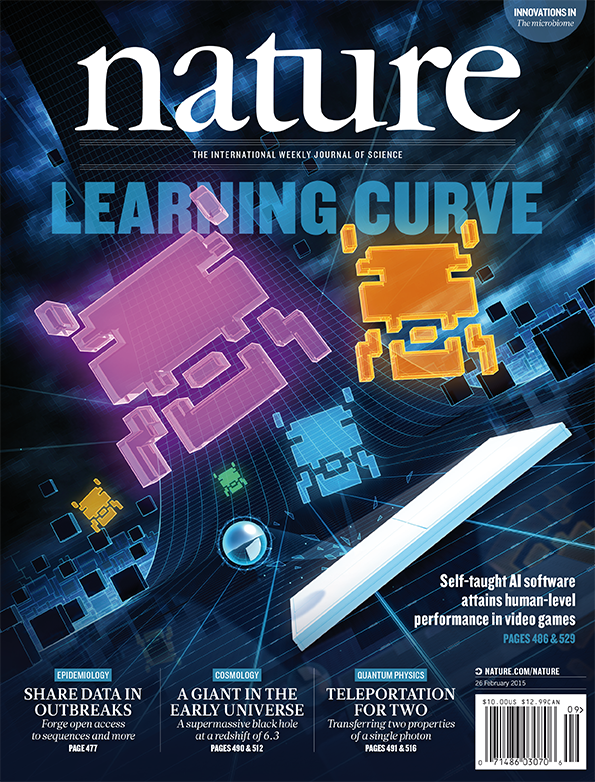
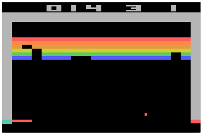

name: title
class: center, middle, title

# Reinforcement Learning
## and DeepMind

Piotr Januszewski

---

.left-column[
## DeepMind
### - Kto to?
]

.right-column[
# Londyn 2010
Firmę założyli Demis Hassabis, Shane Legg i Mustafa Suleyman w 2010 roku w Londynie.

> Solve intelligence.
> Use it to make the world a better place.

Ich celem jest "rozwiązać inteligencję" i tym samym stworzyć system, który będzie w stanie nauczyć się rozwiązywać dowolnie skomplikowany problem, bez potrzeby wskazania jak.
]

???

1. Hassabis i Legg poznali się na University College London.
2. Stworzenie sztucznej inteligencji, która będzie **w stanie ogarnąć wiele problemów**, nie potrzebując przy tym specyficznych zmian, aby to osiągnać.

---

.left-column[
## DeepMind
### - Kto to?
### - Debiut
]

.right-column[
### Playing Atari with Deep Reinforcement Learning![:super]
Komputer gra w 7 gier Atari 2600, w 6 z nich gra lepiej niż kiedykolwiek. W trzech z nich pokonuje człowieka na poziomie eksperta.
### Human-level control through deep reinforcement learning![:super]
49 gier Atari 2600. W 29 komputer gra na poziomie człowieka lub lepszym.
]

.footnote[
![:script][Volodymyr Mnih, Koray Kavukcuoglu & David Silver, *Playing Atari with Deep Reinforcement Learning*, Dec 2013](https://arxiv.org/abs/1312.5602)  
![:script][Volodymyr Mnih, Koray Kavukcuoglu & David Silver, *Human-level control through deep reinforcement learning*, "Nature" 518, Feb 2015](https://www.nature.com/nature/journal/v518/n7540/full/nature14236.html)
]

???

1. Przez te eksperymenty starają się **dojść do swojego celu**, jakim jest wszechstronna sztuczna inteligencja.
2. Zastosowanie **jednej i tej samej techniki** do każdej gry.
3. Po opublikowaniu pierwszej pracy, **Google postanowiło ich kupić** w styczniu 2014 roku za 500 mln dolarów.
4. Druga praca pojawiła się na łamach **czasopisma "Nature"**... (kolejny slajd). Model gra lepiej niż wszystkie poprzednie metody w 43 grach, a w 29 na poziomie człowieka bądź lepiej.

---

.left-column[
## DeepMind
### - Kto to?
### - Debiut
### - Okładka Nature
]

.right-column[
.center[

]]

???

Powiedz co to za czasopismo.

---

.left-column[
## RL
### - Cel
]

.right-column[
# Breakout
Wejściem dla przykładowego modelu są 84x84 piksele aktualnego oraz trzech poprzednich obrazów gry w skali szarości. Chcemy, aby ten model nauczył się ruszać paletką w lewo, w prawo i wystrzelić piłkę na początku gry. *Proste, czyż nie?*
.center[

]
]

???

0. **Czym jest model? Czarna puszka**, która coś dostaje i decyduje jak reagować. Dojdziemy co tam siedzi.
1. **Model otrzymuje wejście i porusza** paletką. Ma się nauczyć jak to robić na podstawie tylko pikseli obrazu gry. Dostaje cztery obrazy, aby widzieć zmianę w środowisku (ruch).
2. Można by **nagrać rozgrywki ludzkich graczy** i kazać modelowi robić to samo. Ale nie w ten sposób się uczymy!
3. Ludzie oraz ogólnie **zwierzęta uczą się na podstawie próbowania** i otrzymywania od czasu do czasu odpowiedzi jak im idzie. W szkole dostajemy oceny, w domu nagrody, a w pracy wypłatę. (Takie uczenie jest trudne, kolejny slajd...)

---

.left-column[
## RL
### - Cel
### - Problemy
]

.right-column[
## Nagroda jest opóźniona
Moment dotknięcia piłeczki przez paletkę oraz otrzymania za to nagrody dzieli pewien czas. W dodatku często ciężko powiedzieć, jaka dokładnie akcja skutkowała otrzymaniem nagrody.

## Czy ryzykować?
Model czegoś się nauczył i gra nawet nieźle. Powinien brnąć w tą strategię dalej, czy próbować nowych innych technik?
]

???

1. **Nagroda jest opóźniona** i ciężko powiedzieć co doprowadziło do otrzymania nagrody.
2. **Czy ryzykować?** To pytanie każdy sobie stawia wiele razy w swoim życiu. Tak samo musi decydować model, czy warto próbować innej strategii, czy ta którą się nauczył jest wystarczająca?

---

layout: true

.left-column[
## RL
### - Cel
### - Problemy
### - MDP
]

---

.right-column[
## Sformalizować uczenie ze wzmocnieniem
.center[

]
Agent obserwuje środowisko. Podejmuje akcje na podstawie stanu środowiska w którym się znalazł oraz swoich zasad. Podjęta akcja wpływa na środowisko (nie koniecznie w pełni przewidywalny sposób), a agent dostaje odpowiedź w postaci nagrody (lub jej braku).
]

???

1. **Należy sformalizować** w jakiś sposób uczenie ze wzmocnieniem, aby móc ją zamodelować na komputerze.
2. Wytłymacz z przykładami **czym są i jakie są relacje** agenta, środowiska, akcji, stanu, nagrody i zasad.

---

.right-column[
## Sformalizować uczenie ze wzmocnieniem
.center[

]
Zbiór stanów i akcji wraz z zasadami jak je podejmować oraz nagrodami za pewne akcje tworzą proces decyzyjny Markov-a.
]

???

1. Stany, akcje, nagrody wraz z zasadami **tworzą MDP**.
3. **Wskaż na diagram** jako przykładowy proces decyzyjny Markova.
2. > "Mówilismy o zasadach podejmowania decyzji, naszej polityce. Ale czym ona jest?"
   
   **Zasady mogą być** po prostu losowym wybieraniem akcji lub bardziej wymyślnym sposobem. Optymalne jest wybieranie akcji, która daje nam największą sumę wszystkich przyszłych nagród. (Ale do tego musielibyśmy je znać... następny slajd.)
   

---

layout: true

.left-column[
## RL
### - Cel
### - Problemy
### - MDP
### - Q-learning
]

---

.right-column[
### Całkowita przyszła nagroda
.center[]
Całkowita przyszła nagroda jest sumą nagród od momentu 't' aż do moment 'n', który jest końcem gry.
### Całkowita obniżona przyszła nagroda
.center[]
Ponieważ nasze środowisko nie jest w pełni przewidywalne, powinniśmy jakoś to uwzględnić. Zatem wielkość każdej nagrody im dalej w przyszłość tym bardziej będzie obniżona o współczynik \\(\gamma\\) (\\(0 < \gamma < 1\\)). 
### ...tak samo, ale inaczej
.center[]
]

???

1. Załóżmy, że znamy przyszłość. Tak możemy zdefiniować naszą **całkowitą przyszłą nagrodę**.
2. Ponieważ nie jesteśmy pewni, że za każdym razem otrzymamy taką samą nagrodę, musimy ją odpowiednio **obniżyć im dalej patrzymy w przyszłość**.
3. **Zapisane inaczej**.

---

.right-column[
### Funkcja wartości akcji
.center[]
Funkcja ta mówi nam, jaka jest w stanie 's' po podjęciu akcji 'a' maksymalna całkowita przyszła obniżona nagroda.
### Teraz możemy zdefiniować naszą optymalną politykę (zasady podejmowania akcji)
.center[]
W stanie 's' zawsze podejmujemy taką akcję 'a', która da nam największą maksymalną całkowitą przyszłą obniżoną nagrodę.
]

???

1. **Funkcja wartości akcji Q** mówi nam, jaka jest w stanie 's' po podjęciu akcji 'a' maksymalna całkowita przyszła obniżona nagroda.
2. **Optymalna polityka**: W stanie 's' zawsze podejmujemy taką akcję 'a', która da nam największą maksymalną całkowitą przyszłą obniżoną nagrodę.

---

.right-column[
## Ostatnie pytanie... jak znaleźć taką funkcję?
W najprostrzy sposób, można przedstawić ją tablicą w której każda para stan-akcja mają swój wpis. Na początku wypełnić ją losowo i w miarę grania przez naszego agenta, uaktualniać ją w następujący sposób:

.center[]
Istnieje matematyczny dowód, że takie uaktualnianie tablicy Q dąży do optymalnej funkcji wartości akcji.

### Ale czy to jest na pewno wystarczająca metoda?
Cztery obrazy 84x84 pikseli w skali szarości dają nam \\(256^{4\times84\times84}\approx10^{67960}\\) stanów, czyli znacznie więcej niż cząsteczek w widzialnym Wszechświecie.

]

???

1. Naprostrzy sposób to przedstawić **Q jako tablicę** i uaktualniać ją równaniem Bellman-a.
2. Kiedy par stan-akcja zrobi się więcej niż częsteczek w widzialnym Wszechświecie (\\(10^{78}\\)), należy czymś tą **tablicę zastąpić**. Można to zrobić siecią nauronową i w takim wypadku nazywa się ona Deep Q Network, a algorytm Deep Q-learning.

---

## Rozwiązanie problemów

.right-column[
### Nagroda jest opóźniona

Nasza funkcja Q w momencie kiedy musimy podjąć akcje bierze pod uwagę, że nagroda pojawi się w przyszłości.

### Czy ryzykować?

W trakcie uczenia do naszej optymalnej polityki możemy dodać pewne prawdopodobieństwo podjęcia losowej akcji. Tym samym złamiemy naszą politykę, ale pozwalamy naszemy modelowi na eksplorację środowiska.
]

???

1. **Nagroda jest opóźniona**, ale funkcja Q bierze to pod uwagę.
2. **Czy ryzykować?** Podczas uczenia tak z pewnym prawdopodobieństwem.

---

layout: false

.left-column[
## Przykłady
### - Seaquest
]

.right-column[
### "Wartość" przykładowych stanów

1. Kiedy przeciwnik pojawia się z lewej strony ekranu, funkcja wartosci zwraca większe wartości.
2. Zaraz przed uderzeniem torpedy w przeciwnika, funkcja wartości ma największą wartość.
3. Po zniszczeniu przeciwnika wartość spada.
]

???

Obrazki przedstawiają pewne stany gry Seaquest, a wykres wskazuje ich wartość według modelu.

---

.left-column[
## Przykłady
### - Seaquest
### - t-SNE
]

.right-column[

]

???

1. t-SNE to metoda reprezentowania wielowymiarowej przestrzeni w 2D. **Stany "podobne" leżą bliżej** siebie.
2. **Obrazki** są związane z konkretnymi **stanami i ich wartościami** (oczekiwaną nagrodą).
3. Górne lewe i środkowe oraz dolne prawe **nie są podobne percepcyjnie**, ale są podobne swoją wartoscią i dlatego leżą blisko siebie. Sieć potrafiła się tego nauczyć.

---

.left-column[
## Przykłady
### - Seaquest
### - t-SNE
### - Porównanie
]

.right-column[

]

???

1. Wykres przedstawia **porównanie DQN do ludzi i innch metod**. Procenty to jak dobrze względem człowieka poradził sobie model (w uproszczeniu).
2. **Przedstaw grę** w której model sobie w ogóle nie radzi (następny slajd) oraz w której powalił człowieka na łopatki (jeszcze kolejny slajd).

---

.left-column[
## Przykłady
### - Seaquest
### - t-SNE
### - Porównanie
]

.right-column[
## Montezuma's Revenge

Środowisko w tej grze jest bardzo złożone i różnorodne, a cele nie są trywialne.
]

???

Środowisko w tej grze jest bardzo złożone i różnorodne, a cele nie są trywialne.

---

.left-column[
## Przykłady
### - Seaquest
### - t-SNE
### - Porównanie
]

.right-column[
## Video Pinball

Proste środowisko i jasno zdefiniowane nagrody.
]

???

Proste środowisko i jasno zdefiniowane nagrody.

---

.left-column[
## Przykłady
### - Seaquest
### - t-SNE
### - Porównanie
### - Filmiki
]

.right-column[
## Przykładowe rozgrywki
[Film](https://www.youtube.com/watch?v=iqXKQf2BOSE) przedstawia dwie przykładowe rozgrywki z dwóch gier w różnych stadiach rozwoju sieci. Gry to Breakout oraz Space Invaders.
]

---

# Podsumowanie

## Jeden model, wiele problemów
DeepMind przedstawiło model, który otrzymując "gołe" piksele oraz nagrody jako wejścia, z użyciem jednej i tej samej metody uczenia jest w stanie zrozumieć wiele zróżnicowanych środowisk.

## Neurobiologiczne poszlaki
Model ten musiał sam nauczyć się widzieć, a następnie zrozumieć co widzi. Zrobił to otrzymując jedynie nagrody za podjęte przez siebie akcje. Sugeruje to, że sygnały o nagrodach podczas rozwijania percepcji, mogą mieć również wpływ na rozwój kory wzrokowej.

???

1. Model i metody uczenia te same, ale różne środowiska. **Wielki krok w stronę wszechstronnej** sztucznej inteligencji.
2. Taki sposób uczenia, kiedy za pewne akcje agent zostaje nagrodzony, zdaje się mieć również **powiązanie z rozwojem kory wzrokowej**. Model musiał się sam nauczyć widzieć, a nie dostawał wskazówek w tej kwestii.

---

class: center, middle

# Dziękuję :)
## Pytania?

---
class: middle

# Źródła
https://www.nervanasys.com/demystifying-deep-reinforcement-learning/  
https://arxiv.org/abs/1312.5602  
https://www.nature.com/nature/journal/v518/n7540/full/nature14236.html
https://en.wikipedia.org/wiki/Markov_decision_process
https://en.wikipedia.org/wiki/Reinforcement_learning
